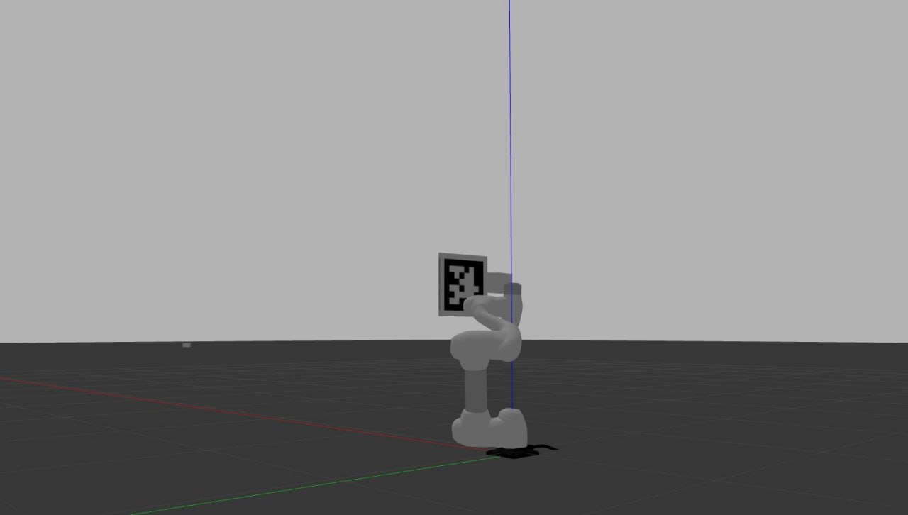
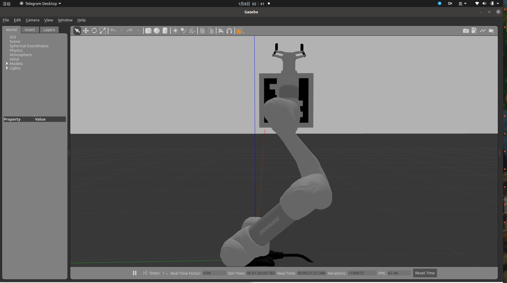
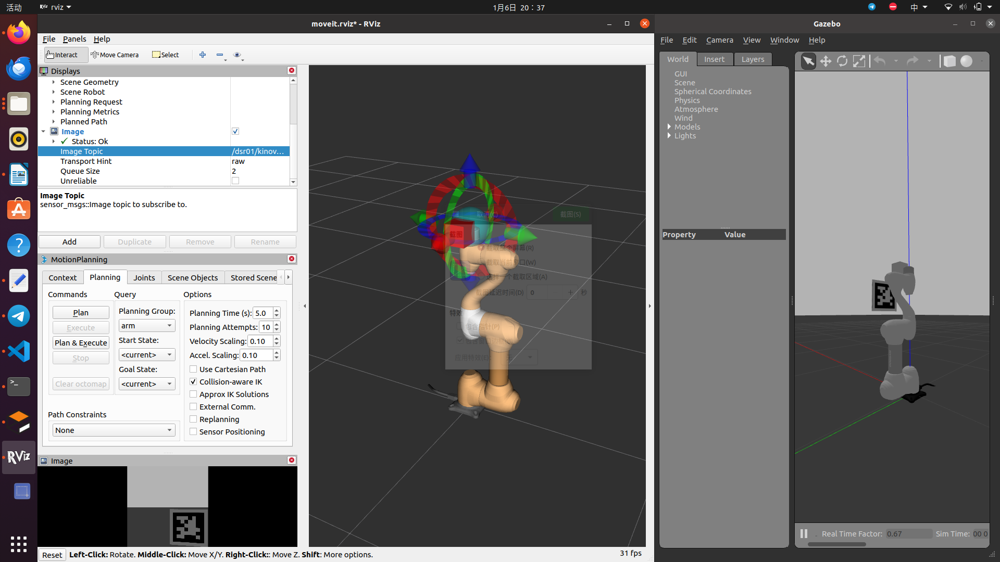
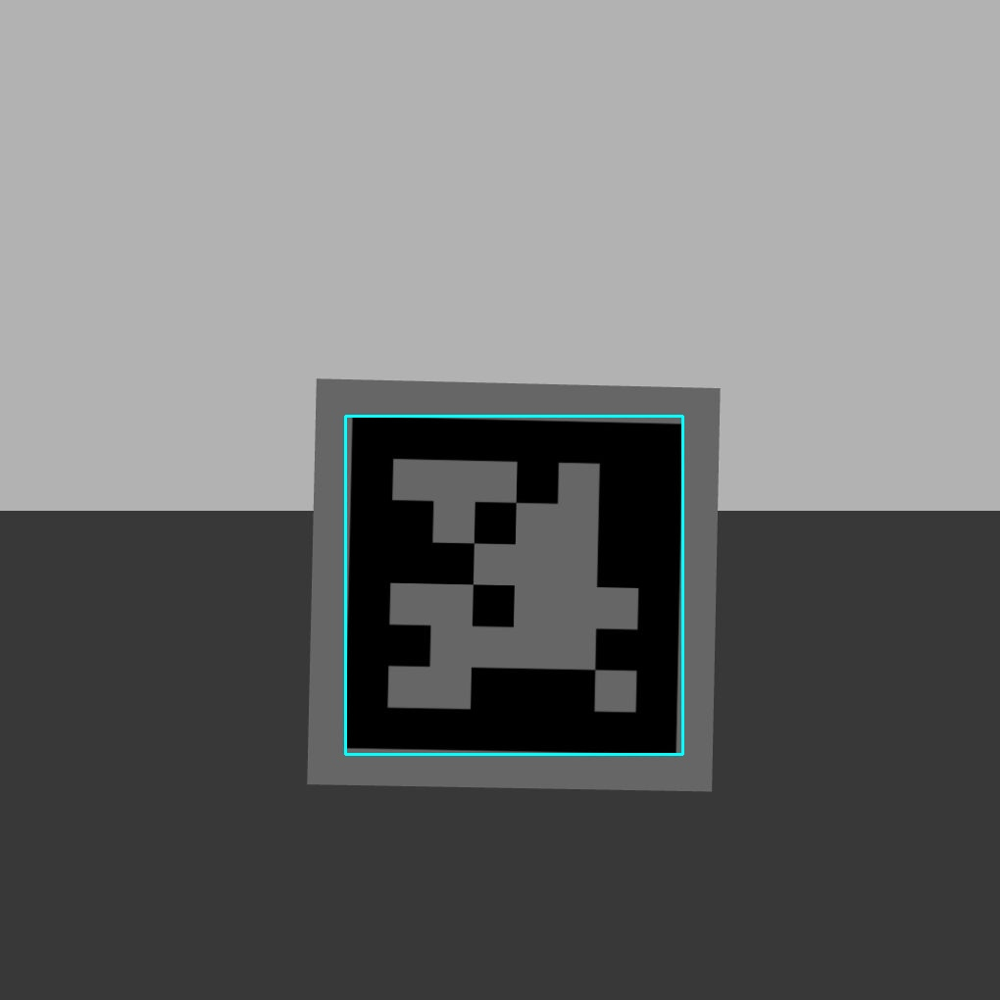
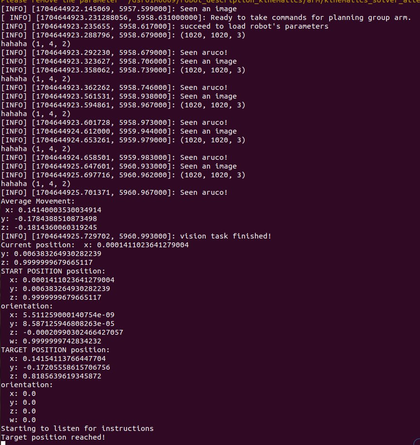

# EYE-IN-HAND IBVS SIMULATION USING ARUCO TAG
 Qian Zilling, Atanda Abdullahi Adewale, Nauman Shafique Hashmi  

# Objective:
The aim of this VIBOT MSFT course project is to implement or simulate an eye-in-hand image-based visual servo control in Gazebo using a Doosan M0609 robotic arm manipulator with a camera mounted on its end effector. The visual features will be provided from 4-points in an Aruco tag.

# Dependencies:
This projects runs in ROS noetic, Opencv-python, Move-it! and Gazebo.

# PART 1
## Robot Structure Definition, Add components and Gazebo Scene Setup:

#### [main.xacro](version2/manipulator_description/xacro/main.xacro)
- Build and configure the robotic structure for the Doosan M0609 robotic arm using URDF and Xacro.
- Add a onrobot_rg2 gripper to the end effector.
- Add the Camera 

<pre>
  < robot >
  
  < !-- Define customizable properties -->
  ...
  < !-- Assign property values for clarity -->
  ...
  < !-- Include relevant Xacro files for modularity -->

  < !-- Include the onrobot_rg2 macro for gripper components -->
  < xacro:onrobot_rg2 prefix="my_robot_rg2"/>
    
  < !-- Define the world link -->
  < link name="world" />
  < !-- Create a fixed joint between the world and the robot's base -->
  
  < !-- Create a fixed joint representing the robot's wrist (effector) -->
  < joint name="wrist" type="fixed">
    < origin xyz="0 0 0" rpy="0 0 0"/>
    < parent link="link6"/>
    < child link="my_robot_rg2onrobot_rg2_base_link"/>
  < /joint>

  < /robot>
</pre>

#### [camera.xacro](version2/manipulator_description/urdf/camera.xacro)
- Defines a camera link (camera_link) as a visual box with a specified size and a red color for Gazebo simulation.
- Integrate a camera at the end effector joint. Creates a fixed joint (camera_joint) to rigidly attach the camera link to its parent link ("link6")
- Configures the camera to simulate a camera sensor, then define a ROS Gazebo plugin interfaces for the simulated camera for information about camera topics and distortion parameters.

<pre>

  < robot xmlns:xacro="http://www.ros.org/wiki/xacro" name="kinova">
    
  < !-- Define customizable properties -->
  < link name="camera_link"> ... </link>

  < joint name="camera_joint" type="fixed">
    < parent link="link6"/>
    < child link="camera_link"/>
    < origin rpy="${M_PI/2} ${-M_PI/2} 0" xyz="${offset_from_link_x} ${offset_from_link_y} ${offset_from_link_z}"/>
    < axis xyz="1 0 0" />
  < /joint>

  < gazebo reference="camera_link">
    < sensor type="camera" name="camera_camera_sensor">
      ...
      < plugin name="camera_camera_controller" filename="libgazebo_ros_camera.so">
      ...
      < /plugin>
    < /sensor>
  < /gazebo>

  < /robot>
</pre>

#### [generatear.py](generatear.py)
#### [arucoworld.world](version1/visual_servoing/worlds/arucoworld.world)
- This file generates differents 6x6 aruco tags [0-29] then plces them in the .gazebo/models folder 
- This will be accesible in gazebo with a drag and drop operation
- We save the gazebo scene containing Aruco to visual_servoing/world/arucoworld.world file for easy reuse

# PART 2
## Move-it and Motion Planning
#### [dsr_moveit_gazebo.launch](version1/m0609_moveit_config/launch/dsr_moveit_gazebo.launch) 
- This is a modified Move-it main launch file 
- It calls the default doosan move-it packages and config files to manage the movement of the m0609 robot arm.

# PART 3
## Camera Image processing, Aruco Tag Detection, 4 corner points Extraction, Coordinate Transformation, Moveit Integration and Visual servoing, manipulate the robot in Cartesian space: 

### version 1 -->  [viso.py](version1/visual_servoing/scripts/viso.py)
This realized the DLT method to localize the robot. It used solve PnP to get the aruco position, 
then we use moveit to move the end-effector link of our robot to the desired position. It’s like parking a car in the correct position.

We have 2 callback functions:

##### image_callback 
- Subcribe to gazebo_camera Topic at  <b>'/dsr01/kinova/camera/image_raw/compressed'</b> to get raw image
- Convert Image Format to OpencV format and grayscale
- ArUco Detection  <b>cv2.aruco.Detector</b>  using camera and detector parameters (intrinsic matrix, distortion coefficients, marker_length etc)
- Extract the 4 corner points of the detected Aruco tag with <b>detector.detectMarkers(gray)</b>
  <pre> self.corners_list, self.ids, self.rejectedImgPoints  = detector.detectMarkers(gray)</pre>
- Estimates the relative position and pose (rotation and translation) of each detected marker.
- Processes the marker information, Calculates the average movement and Publish the relative position information to topic  <b>'/movement'</b> Trigger the second callback function

<b>my_estimatePoseSingleMarkers</b>  performs Coordinate Transformation i.e transform the ArUco tag's corner points to align them with the end effector's coordinate system.
- Defines the 3D coordinates of marker corners in a known marker coordinate system.
- For each detected marker, uses solvePnP to estimate its rotation and translation vectors, appends and returns the calculated vectors.

<b>process_ar(self, corners_list, frame)</b> function visualizes the detected ArUco markers on the input image frame.
- Draws rectangles around the detected markers on the input image frame.
  

##### target_callback

- Sets the target of end_effector_link and plan the movement of arm,and move the arm usig moveit!.
- <b>moveit_commander</b>  to integrate MoveIt! i.e to initialize and interact with MoveIt components for motion planning and control 
  moveit_commander is a Python API provided by the MoveIt library to interact with MoveIt using Python scripts.
  It acts as a convenient wrapper around the MoveIt functionality, allowing users to control and plan motions for robotic arms.

  <pre>
        moveit_commander.roscpp_initialize(sys.argv) < !-- Initializes the ROS C++ API.-->
        < !-- moveit_commander recieves robots parameter in ROS parameter server as self.robot,  -->
        self.robot = moveit_commander.RobotCommander(robot_description="/dsr01m0609/robot_description", ns = '/dsr01m0609')
   
        < !--read the control group in the ROS param server as self.arm -->
        self.arm = moveit_commander.MoveGroupCommander(name="arm",robot_description="/dsr01m0609/robot_description", ns = '/dsr01m0609')
   
        < !-- Retrieves the end effector link of the robot arm. -->
        self.end_effector_link = self.arm.get_end_effector_link()  
   
        < !-- Sets the reference frame for motion planning to "base_0." -->
        self.reference_frame = 'base_0'
        ...
        ...
        ...
  </pre>
  
- Use the computed transformations to generate a trajectory for the robot's end effector.
<pre>
  def target_callback(self, msg):
    self.detector_enabled = False
    movements = msg.position
    current_position = self.arm.get_current_pose().pose  # Get current position

    # Adjust the target position relative to the current robot arm position
    self.target.position.x = current_position.position.x + movements.x
    self.target.position.y = current_position.position.y + movements.y
    self.target.position.z = current_position.position.z + movements.z

    # ... (other code)

    if target_x != current_x or target_y != current_y or target_z != current_z:
        # Set the target pose for the robot arm
        self.arm.set_pose_target([target_x, target_y, target_z, 0.98, 0, 0, 0])

        # Plan and execute the trajectory to reach the target pose
        self.arm.go()

        print('Target position reached!')
    else:
        print("Current state is equal to the goal state")
</pre>

In summary, the <b>self.arm.set_pose_target</b> method sets the target pose, and the <b>self.arm.go()</b> method is used to generate a trajectory and move the robot's end effector along that trajectory to reach the target pose. MoveIt takes care of the details related to motion planning and execution.
  

Launch the Gazebo ans Run the ROS nodes and observe the robot's movement in response to the Aruco tag.
<pre>
  roslaunch m0609_moveit_config dsr_moveit_gazebo.launch
  roslaunch visual_servoing vsm.launch
</pre>

### version 2 -->  [viso_follow.py](version2/visual_servoing/scripts/viso_follow.py)
This uses the Jacobian matrix to calculate velocity from the error vector: [u-u_star,v-v_star].
We didn’t find how to set the velocity, so we simulate the process still using target position control method. 
We assume each iter means one second in real world.

We have 2 call_back functions,but the difference here is in the first;

##### image_callback
Extract depth information from the ArUco marker's translation vector (tvec) obtained through the pose estimation, Z is then used in the Jacobian matrix calculation then obtain jacobian matrix and the 2d image error to calculate the relative position and rotation of the aruco tag in each iteration(i.e each second) and publish to the <b>'/movement' </b> Ros service. Since Ros services are Synchronous. 

Depth Z, Calculation of Jacobian, Computation of error vector (self.e)
<pre>
 self.Z = tvec[0][-1].item()
 self.Jacobi = np.linalg.pinv(self.Jacobi) (line 119)
 self.e =np.array([[self.u_star-self.u],[self.v_star-self.v]]) (line 121)
</pre>
Velocity computation and Iterative loop: 
<pre>
 self.movement_temp = self.lambd * self.Jacobi @ self.e (line 123)
 while np.linalg.norm(self.e) >= self.threshold: (line 132)
</pre>
Condition for Movement:
<pre>
self.threshold=0.007 (line 115)
if np.linalg.norm(self.e) < self.threshold '(line 131) 
</pre>

This condition check is a termination criterion for the iterative visual servoing process. Once the Euclidean norm of the error vector falls below the predefined threshold, the code assumes that the robot has reached the desired target position and orientation, and it disables further movement and shuts down MoveIt resources.

The Euclidean norm of the error vector is a measure of the magnitude or distance of the error in the visual servoing system. When this norm falls below a predefined threshold, it indicates that the current error or difference between the actual and target positions is small enough, and the system can be considered to have reached a satisfactory or accurate position.
 
##### target_callback
Is almost the same with version one, it react to service request instead.
  

Launch the Gazebo ans Run the ROS nodes and observe the robot's movement in response to the Aruco tag.
<pre>
  roslaunch m0609_moveit_config dsr_moveit_gazebo.launch
  roslaunch visual_servoing vsm.launch
</pre>

